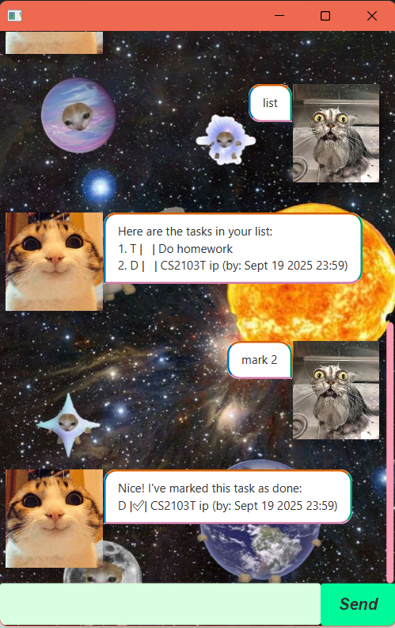

# Serene User Guide



Serene is your personal productivity assistant designed to help you keep track of tasks, deadlines, recruiter notes, and important events. With its simple command-based interface and clean GUI, Serene makes organizing your schedule effortless.

## Adding todo tasks: `todo`

Add a simple task with just a description.

Example: `todo Do homework`

```
Got it! I've added this task:
T |  | Do homework
```

## Adding deadline tasks: `deadline`

Add a task with description and deadline in YYYY-MM-DD HH:mm format.

Example: `deadline Finish CS2103 report /by 2025-09-30 23:59`

```
Got it. I've added this task:
D |  | Finish CS2103 report (by: Sep 30 2025 23:59)
```

## Adding event tasks: `event`

Add a task with description, a from-date, and a to-date(in YYYY-MM-DD HH:mm format).

Example: `event Korea trip /from 2025-08-12 12:00 /to 2025-08-22 16:30`

```
Got it! I've added this task:
E |  | Korea trip (from: Aug 12 2025 12:00 to: Aug 22 2025 16:30)
```

## List all tasks: `list`

To view all tasks.

## Marking a task: `mark`

Marks the task with the given index as done.

Example: `mark 1`

```
Nice! I've marked this task as done:
1. T |✅| watch CS2103T lecture
```

## Unmarking a task: `unmark`

Unmarks the task with the given index.

```
Ok, I've marked this task as not done yet:
1. T |  | watch CS2103T lecture
```

Example: `unmark 1`

## Deleting a task: `delete`

Deletes the task with the given index.

Example: `delete 1`

```
Noted. I've removed this task:
1. T |  | watch CS2103T lecture
```

## Finding tasks: `find`

Finds tasks whose description contain any of the given keywords

Example: `find CS2103T`

```
Here are the matching tasks in your list:
1. T |  | watch CS2103T lecture
2. D |  | do CS2103T tutorial (by: Sept 19 2025 12:00)
```